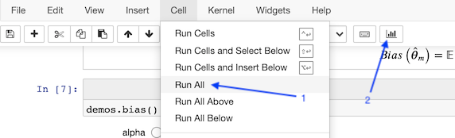

# Deep learning book club presentations

## Notebook contents

| Notebook                                                                                         | Contents                                                               |
| ------------------------------------------------------------------------------------------------ | ---------------------------------------------------------------------- |
| [Machine Learning Basics - Part I.ipynb](Machine%20Learning%20Basics%20-%20Part%20I.ipynb)       | *Hyperparameters and Validation Sets*; *Estimators, Bias and Variance* |
| [Deep Feedforward Networks - Part II.ipynb](Deep%20Feedforward%20Networks%20-%20Part%20II.ipynb) | *Back-Propagation*                                                     |

## Playing the slides

```bash
# Clone the repo.
git clone https://github.com/yannidd/dl-book-presentations.git
cd dl-book-presentations

# Create a Python environment and install dependencies.
python3 -m venv .env
source .env/bin/activate
pip install -r requirements.txt

# Start a Jupyter notebook server.
jupyter-notebook
```

Then open one of the notebooks, run all cells and play the presentation (see below).


